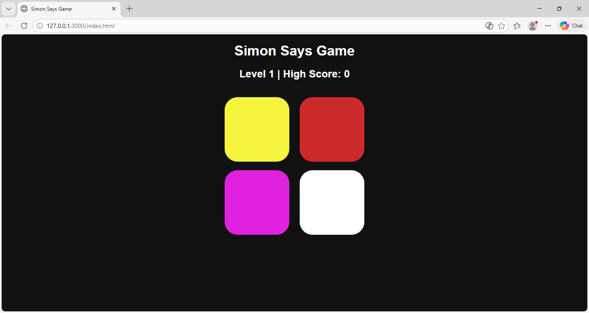

# 🎮 Simon Says Game | Memory Challenge

A simple and interactive Simon Says game built using HTML, CSS, and JavaScript.

## 🚀 Features
- Random color sequence generation
- User input matching system
- Level progression
- High score tracking

## 🧠 How to Play
1. Press any key to start the game
2. Watch the sequence of colors
3. Repeat the sequence by clicking buttons
4. Game gets harder with each level

## 🛠️ Tech Stack
- HTML
- CSS
- JavaScript

## 📸 Screenshot
Here’s a preview of the game:

## 🌐 Live Demo
👉 [Play the Game](https://ankkitsingh.github.io/simon-says-game/)

---

## 💡 Future Improvements
- Sound effects
- Mobile responsiveness
- Better UI animations